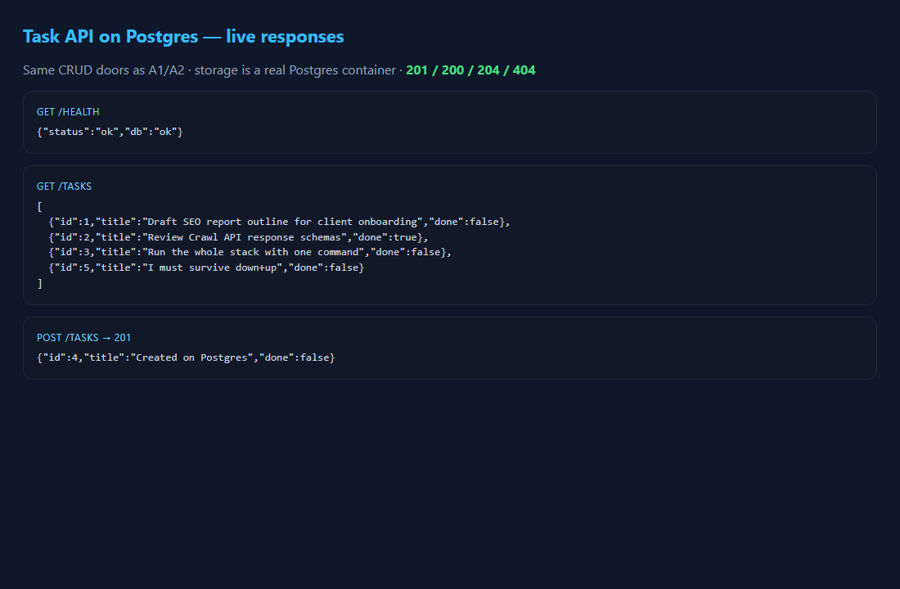
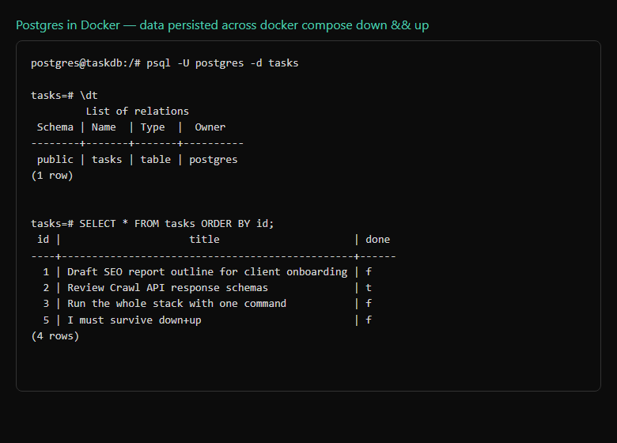

# Task API · Containerized Postgres — FlyRank A3

The third storage swap in the same story: **memory (A1) → SQLite (A2) → Postgres in Docker (A3)**. The five CRUD doors never changed; only the room behind them did. Now the whole stack — app + database — starts with **one command**.

## Run the whole stack

```bash
cp .env.example .env
docker compose up
```

That's it. `docker compose up` builds the app image, starts Postgres with a volume, waits until the DB is healthy, then starts the API. On first run the `tasks` table is created and seeded with three example rows.

- API: http://localhost:3000/  (override with `API_PORT=3005 docker compose up` if 3000 is busy)
- Swagger: http://localhost:3000/docs

## Configuration (secrets in the environment)

The database password is **never** hardcoded or committed. It lives in `.env` (git-ignored); `.env.example` is committed so a teammate knows which keys to set.

```
DATABASE_URL=postgres://postgres:dev@db:5432/tasks
```

Inside the compose network the app reaches the database by the **service name `db`**, not `localhost`.

## Endpoints

| Method | Path | Status | SQL |
|--------|------|--------|-----|
| GET | `/` | 200 | meta |
| GET | `/health` | 200 | `SELECT 1` (reports `db: ok`) |
| GET | `/tasks` | 200 | `SELECT * FROM tasks` |
| GET | `/tasks/{id}` | 200 / 404 | parameterized `SELECT ... WHERE id = %s` |
| POST | `/tasks` | 201 / 400 | `INSERT ... RETURNING *` |
| PUT | `/tasks/{id}` | 200 / 400 / 404 | parameterized `UPDATE` |
| DELETE | `/tasks/{id}` | 204 / 404 | parameterized `DELETE` |

404 body: `{"error":"Task not found"}`. All queries use `%s` placeholders — no string-glued SQL.

## What it looks like

API responses against the live Postgres stack:



## Persistence (proven)

Created a task, ran `docker compose down`, then `docker compose up` — the task was still there because the named **volume** `taskdata` outlives the container:



Run without a volume and the data dies with the container — that's exactly why volumes exist.

## Example `curl -i`

```http
HTTP/1.1 201 Created
content-type: application/json

{"id":4,"title":"Created on Postgres","done":false}
```

## Why identical behaviour across three engines matters

The same curl commands pass against memory, SQLite, and Postgres. That's the proof that **storage is an implementation detail**: the API is the promise, the database is just where the promise is kept. (A later assignment, A15 — Layered architecture, formalizes the repository boundary this project already keeps in `repository.py`.)

## Files

```
app.py            # FastAPI routes (unchanged shape from A1/A2)
repository.py     # the ONLY module that talks to Postgres (psycopg, parameterized)
Dockerfile        # app image (python:3.12-slim)
compose.yaml      # api + db services, volume, healthcheck, depends_on
.env.example      # committed; real .env is git-ignored
ai-version/       # Stage 6 AI rematch (quarantine)
```

## AI vs me (Stage 6)

Prompts: [`ai-version/PROMPT_v1.md`](ai-version/PROMPT_v1.md), [`ai-version/PROMPT_v2.md`](ai-version/PROMPT_v2.md).

**v1's classic mistakes** (see [`ai-version/compose.yaml`](ai-version/compose.yaml)):

1. **Hardcoded password** in the compose file instead of `${POSTGRES_PASSWORD}` from `.env`.
2. **`localhost`** in `DATABASE_URL` instead of the service name `db` — the api can't reach the db inside the compose network.
3. **No volume** — data vanishes on `docker compose down`.
4. **No healthcheck / `depends_on: condition`** — the api can start before Postgres is accepting connections.

**What my prompt forgot (v1):** I didn't demand a volume, a healthcheck, or say "read the password from `.env`". The rematch prompt ([`compose_v2.yaml`](ai-version/compose_v2.yaml)) spells all of that out and lands much closer to the hand-built stack.

```bash
git diff --no-index compose.yaml ai-version/compose.yaml
git diff --no-index compose.yaml ai-version/compose_v2.yaml
```

## Commits

- Stage 0: Postgres in Docker + gitignore
- Stage 1: connect via .env and create table
- Stage 2: read from Postgres
- Stage 3: full CRUD on Postgres
- Stage 4: docker-compose the whole stack
- Stage 5: one-command stack + docs
- Stage 6: AI vs me

## License

MIT — FlyRank Backend internship.
